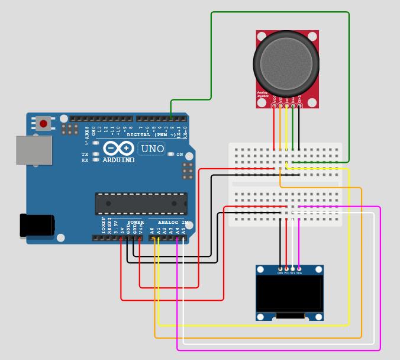
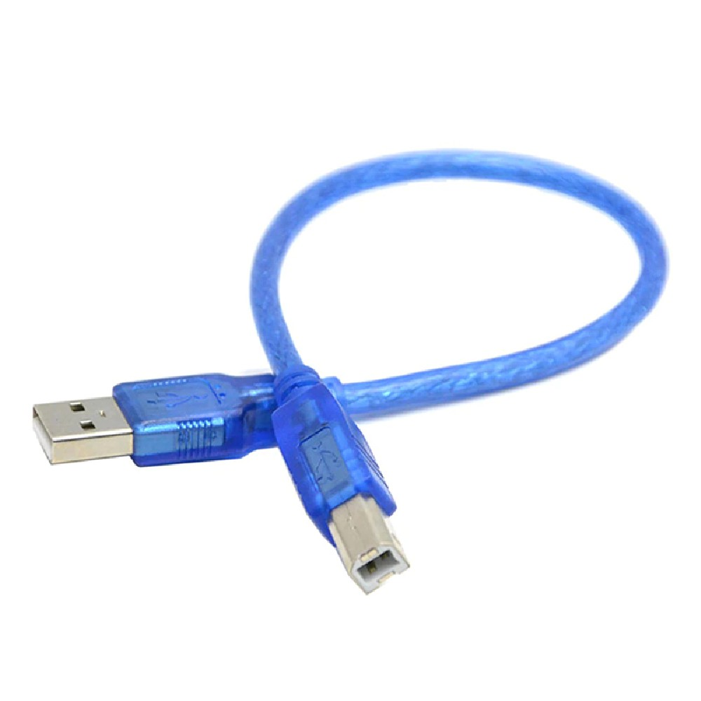

# Arduino Project: small-GameBoy

## Overview

This project is designed to recreate a small GameBoy experience utilizing an Arduino board as its central component. Its primary objective goes beyond creating a singular game solution; it seeks to offer a reusable prototype that hobbyists and enthusiasts can easily adapt and expand according to their needs. By prioritizing simplicity and modularity in the source code development, this project acts as a foundational demo for constructing diverse games or applications on an Arduino-powered small GameBoy.

## Requirements:

1.  **Hardware Requirements**

    - Arduino Board (Uno or similar)
    - SSD1306 OLED Display
    - arduino joystick
    - wire and breadboard components

2.  **Software Requirements**

    Note:

        you can use one of the following tool to compile and upload the code to your Arduino board.

    - Arduino IDE (2.3.4 or later)
      - Download from [Arduino IDE website](https://www.arduino.cc/en/software)
    - Arduino CLI (1.1 or later)
      - Download from [Arduino CLI website](https://arduino.github.io/arduino-cli/)

## Hardware Setup:



you can use `https://wokwi.com/` to edit the hardware setup [file](./diagram.json).

Note:

    The actual physical components used might slightly differ from those depicted in the diagram. You should align your implementation with the pin names of your specific hardware.

## Software Setup:

### step 1 (connecting the hardware to your computer)


Connect your Arduino board to your computer using a dedicated Arduino cable through a USB port, allowing for seamless data exchange between hardware and software environments. On Windows systems, you can discover new Input Output (IO) devices by navigating to the Device Manager, while on MacOS or Linux platforms, such discovery is facilitated via the terminal application.

It's important to be aware that compatibility issues may arise due to various factors; notably, certain USB 3.0 ports might not fully support older third-party Arduino boards. This necessitates careful selection of your hardware and ensuring it is compatible with the version of the Arduino IDE you are using.

### step 2 (download)

- arduino IDE:

  Please ensure you have installed the latest version of the Arduino Integrated Development Environment (IDE) from the official Arduino website (`https://www.arduino.cc/en/software`). This tool is indispensable for writing, compiling, and uploading code to your Arduino board.

- arduino-cli (optional):

  For advanced users or those looking to streamline development processes, consider installing the Arduino Command Line Interface (`https://arduino.github.io/arduino-cli/1.1/installation/`). You can follow the detailed instructions available in the Arduino CLI installation guide to integrate this powerful tool into your workflow. The CLI offers a command-line interface that allows developers to perform tasks more efficiently than through the graphical user interface (GUI).

- Small-GameBoy Source Code:

  To access the source code for creating games compatible with your Small GameBoy setup, download it from GitHub at `https://github.com/leon123858/Arduino-exercise/tree/main/small-gameboy`. This repository encompasses all necessary files and instructions to set up your development environment and successfully run your game on an Arduino board. If you are familiar with Git, you can clone this repository directly from GitHub using the following command:

  ```
  git clone https://github.com/leon123858/Arduino-exercise.git
  cd Arduino-exercise/small-gameboy
  ```

### step 3 (setup compiler and download libraries)

- For Arduino IDE:

  1.  Open the Arduino IDE.
  2.  Go to `Board Manager`.
  3.  Search for the SDK that your real hardware board requires. If you're using an Uno, it will resemble the `Arduino AVR Board`.
  4.  Click the 'Install' button to install this SDK.
  5.  Proceed to download third-party libraries needed for OLED displays by navigating to the `Library Manager` in the toolbar.
  6.  Search for `Adafruit SSD1306` and click 'Install'.

- For Arduino CLI:
  - Customize the `Makefile` by your own requirements.
  - Execute the command `make init` in project directory.

### step 4 (compile and upload)

- For Arduino IDE:

  1.  **Open Your Project**: Double-click on the `./sketch/sketch.ino` file within the Arduino IDE to start.
  2.  **Select Board**: Navigate to 'Tools' > 'Board', and choose the appropriate board that corresponds to your hardware setup.
  3.  **Set Upload Port**: Under 'Tools' > 'Port', select the correct port for uploading your code to your device.
  4.  **Upload Code**: Click on the 'Upload' button in Arduino IDE to compile and transfer your game code to the Arduino.

- For Arduino CLI:

  1.  **Modify Configuration**: Locate the `Makefile` file in your project directory, find the variable `PORT`, and update it with the correct port identifier specific to your computer's setup.
  2.  **Execute Upload Command**: Once the configuration is updated, run the command `make` within the project directory.

## references

- official Arduino documentation: `https://www.arduino.cc/en/Tutorial/HomePage`
- chinese third party introduction: `https://blog.jmaker.com.tw/arduino-tutorials/`

## Code Explanation:

please read: [doc](./docs)

## License:

This project is licensed under the Apache 2.0 License - see the LICENSE file for details.
