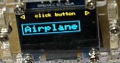
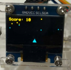
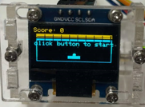
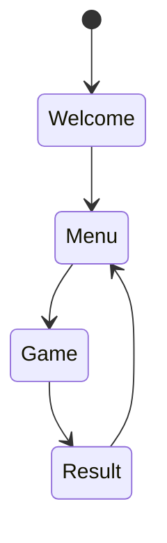

# 從頭開始做 Arduino 電子遊戲機

前段時間和朋友約好玩交換禮物，我利用 Arduino 和 OLED 螢幕製作了一個簡單的電子遊戲機拿來交換。這篇文章將設計過程分享給大家，希望對大家有幫助！

## 目標

實作一個簡單電子遊戲機，包含以下功能：

- 菜單介面可以選擇遊戲
- 幾款小遊戲，包含貪吃蛇、打磚塊與彈幕等





## 開發

### 硬體

第一步是購買元件。決定好要買的東西後，打開購物網站隨便挑一間看得順眼的店家進行採購即可。因為我很懶惰，所以希望能盡量在同一間店把所有元件買齊，雖然事後發現有點買貴，但差價也不大就算了。

選擇螢幕時，我原本想挑 LCD 顯示器，但意外看到 OLED 螢幕，覺得聽起來更高端，於是選擇了 OLED。後來才發現雖然價格差不多，但 OLED 的螢幕有點小。本來想換的，但因為時間臨近，就沒時間重新購買更大的螢幕了。

選擇主機時，我最後選用了非原廠版本的 Arduino Uno，因為它比較常見，價格也相對親民。這次我發現原廠與副廠的差異主要在於用料的紮實度，尤其體現在適配性上。副廠的 USB 控制晶片比較差，導致我在剛拿到的時候，macbook pro 和擴充埠完全偵測不到端口，換到 windows 主機後也還是無法偵測。

之後經過研究，發現因為我的設備都比較新，多數接口屬於 USB3.0 以上的協議，因此不適配副廠的 USB 控制晶片。改用 windows 主機的 USB2.0 接口後，終於正確連接上了。

最後，我的遊戲手把選用了 PS2 的蘑菇頭，包含上下左右和中心按鈕。當時覺得這樣的手把可以讓遊戲玩的更順暢。

其它就是隨便買一些電子零件，包含麵包版、杜邦線、電源之類的，最終的價格如下表：

|        部件        | 量  |  價格  |
| :----------------: | :-: | :----: |
|     OLED 螢幕      |  1  | 185 元 |
| Arduino Uno 開發版 |  1  | 325 元 |
|       電源線       |  1  | 80 元  |
|     PS2 蘑菇頭     |  1  | 50 元  |
|    其他電子零件    |  1  | 60 元  |

總計：185 + 325 + 80 + 50 + 60 = 700 元。

拿到零件後，可以開始參考網路上的文件一個洞一個洞插。這邊我也遇到一個坑，因為這些零件來自各間副廠，他插的孔剛好跟我參考的網路文件相反，所以訊號傳遞錯誤。我後來是透過查詢商家建置的教學網站才得知這一細節。所以結論是在接線時需要仔細檢查實際硬體上的說明，並且比對最適合的網路教學再開始嘗試，務必抱持開放的態度，面對不同副廠零件之間的差異性。

以下幾個連結是我個人喜歡的參考文件，實際上該如何連還是要按照實際硬體狀況:

- [SSD1306](https://docs.wokwi.com/parts/board-ssd1306)
- [joystick](https://docs.wokwi.com/parts/wokwi-analog-joystick)

最後是接線完成後的參考圖:


### 軟體

#### 流程設計

在設計這類 OS-less 的 single core 嵌入式系統時，可以參考的其中一種設計方法是有限狀態機（Finite State Machine, FSM）。可以把整個韌體想像成一個巨大循環，循環內存在著多台可以多層嵌套的狀態機。每次循環就是在每一台狀態機中依據當時的狀態完成一次運算並轉移到下一項狀態。此外，實務上每個狀態機彼此也可以透過某種方法互相溝通，因此每次 FSM 執行所需輸入可以是自己內部的狀態加上別台狀態機提供的狀態。

以下可以用 pseudo code 表達一下這個設計方法:

```cpp
// claiming  global variable for state machine array
global stateMachine[numStateMachines]
// communication channel for each state machine
global communicationChannel

int main() {
	// init all state machines
	for (int i = 0; i < numStateMachines; i++) {
		stateMachine[i] = new StateMachine();
	}

	// infinite loop
	while(true) {
		// call action function of each state machine based on communication channel
		for (int i = 0; i < numStateMachines; i++) {
			stateMachine[i]->Serve(communicationChannel);
		}
	}
}
```

接著，按照真實案例，我想像中的遊戲機使用流程如下:

1. 使用者開機，看到開機畫面
2. 開機後有選單可以選擇不同款遊戲，點擊確認後進入遊戲模式
3. 在遊戲模式中玩遊戲，遊戲結束後顯示得分
4. 玩家確認得分後回到遊戲選單，可以重新選擇遊戲

至此可以畫出整體流程所需的狀態機如下:



其中 Welcome、Menu、Game 和 Result 是狀態機的狀態。各自的定義如下:

- Welcome: 開機初始畫面。
- Menu: 游戲選單，顯示不同款遊戲供用戶選擇。
- Game: 遊戲畫面，玩家可以進行操作，例如按鍵控制角色移動等。
- Result: 遊戲結束，顯示得分。

#### 流程實作

關於 arduino 的開發環境等設置，請自行參考其他文件，也可以參考本專案的 [README.md](../README.md)。

假設已經完成環境配置，打開 Arduino IDE 的 sample code 後應該可以看到以下模板:

```cpp
void setup() {
  // put your setup code here, to run once when the board is powered up
}
void loop() {
  // put your main code here, to run repeatedly
}
```

這兩行就是 Arduino 的生命週期函數，`setup()` 函數在板子啟動時執行一次，而 `loop()` 函數則會不斷重複執行。

因此按照上一節的設計理念，我們可以設計一個 FSM，在 `setup()` 函數中初始化，並在 `loop()` 函數中重複調用該 FSM 的行為函數。這樣就可以完整的實作出目標系統了。

以下就是最終我的 Arduino 專案主程式入口:

```cpp
Controller *controller = nullptr;

void setup()
{
	controller = new Controller();
}

void loop()
{
	controller->Serve();
}
```

下一步就是按照設計中的狀態表實作狀態機 "controller" 的行為函數與內部狀態。

```cpp
enum ControllerState
{
	Welcome,
	Menu,
	Game,
	Result
};

class Controller
{
private:
	ControllerState state;

public:
	Controller(/* args */);
	~Controller();

	void Serve(void);
};

void Controller::Serve(void)
{
	ControllerState curState = this->state;
	switch (curState)
	{
	case Welcome:
		this->state = Menu;
		break;
	case Menu:
		this->state = Game;
		break;
	case Game:
		this->state = Result;
		break;
	case Result:
		this->state = Menu;
		break;
	}
}
```

至此，一個可以空轉的流程實作完畢，可以利用 Serial Monitor 或其他工具來觀察狀態機的動作。

#### 分層架構

有了基本的狀態機後，下一步是讓狀態機可以在行為函數中調用外部 IO 完成輸入輸出，如此一來搖桿可以開始操作狀態機，狀態機也可以透過 OLED 屏幕展示畫面。

想要在系統設計中完成這一步，常見的作法是使用分層架構（Layered Architecture），其思想可以被簡化為以下幾點：

- 權責分配：將系統功能分成不同的層級，每個層級都有自己的任務和責任。
- 解耦：避免不同層級之間的直接依賴，而是通過接口或函數來實現通信。
- 可擴展性：當需要增加新的功能時，只需要修改特定的層級即可，而不需要影響其他層級。

在這個例子中，我們可以將系統功能分成以下幾層：

1. **Controller Layer**：負責控制系統的生命週期，包括初始化、運行和停止等操作。
2. **Service Layer**：負責處理系統的核心業務邏輯，例如遊戲本體的運行、玩家輸入的處理、遊戲畫面的渲染等。
3. **Hardware Layer**：負責與 I/O 硬體通訊，聚焦在純粹硬體操作 API 的串接。

因此，在我的設計中，我會在 Hardware Layer 中實現以下兩個模組:

- Arduino 讀取搖桿動作的功能。
- Arduino 操作 OLED 視窗的渲染功能。

這樣一來，遊戲本體和系統流程就可以和外部 IO 裝置解耦，可以更順利的完成開發和測試。

#### 硬體層實作

在這個層次，主要價值是串接硬體與核心業務邏輯。因此應該盡可能的簡單而明確，不需要額外添加太多功能或複雜性。

在 `sketch\ps2btn.cpp` 中

- 透過 Arduino 開發版直接讀取 pin 上關於搖桿硬體的類比與數位信號，並回傳表示在那個時刻搖桿所檢測到的資訊。
- 利用 Arduino 開發版的 interrupt 機制完成按鈕觸發與搖桿的校正方案等兩點。

使用 `analogRead` 可以讀取對應 pin 的類比訊號，按照教學書中的說明，這是一個 `0` 到 `1023` 的數值，可以表示搖桿在該方向上的位置。

- `VERT_PIN` 表示搖桿的垂直方向。
- `HORZ_PIN` 表示搖桿的水平方向。

```cpp
void PS2Button::updateRawBtnDir(void)
{
	int vert = analogRead(VERT_PIN);
	int horz = analogRead(HORZ_PIN);
	this->controlRawX = vert;
	this->controlRawY = horz;
}
```

我定義了 `enum` 來表示搖桿的指向，當別層調用函數 `getDir` 時可以收到不同的方向。

```cpp
enum BUTTON_DIRECTORY
{
	UP,
	DOWN,
	LEFT,
	RIGHT,
	MID,
};

BUTTON_DIRECTORY PS2Button::getDir(void)
{
	this->updateRawBtnDir();

	int newX = this->controlRawX - naturalMiddle_x;
	int newY = this->controlRawY - naturalMiddle_y;

	if (ABS(newX) < XY_MIDDLE_RANGE && ABS(newY) < XY_MIDDLE_RANGE)
	{
		return MID;
	}

	if (ABS(newX) > ABS(newY))
	{
		if (newX > 0)
		{
			return RIGHT;
		}
		else
		{
			return LEFT;
		}
	}
	else
	{
		if (newY > 0)
		{
			return DOWN;
		}
		else
		{
			return UP;
		}
	}
}
```

上面的 `naturalMiddle_x` 與 `naturalMiddle_y` 存放了搖桿的自然偏移量，可以在下面的 `adjust` 函數被更新，該函數應該盡可能在確定使用者沒有移動搖桿的情境下使用。原理是把未移動的搖桿回傳座標視為中心點。舉例來說，理想的搖桿中心座標應該是 `(512,512)` ，但今天實際的搖桿中心座標卻是 `(400,412)` 因此如果沒有校正座標，最後感測的方向會產生錯誤，所以要改成把 `(400,412)` 設定為中心點，這樣就可以避免這種問題了。

```cpp
void PS2Button::adjust(void)
{
	delay(1000);
	updateRawBtnDir();
	naturalMiddle_x = this->controlRawX;
	naturalMiddle_y = this->controlRawY;
}
```

最後，因為硬體控制搖桿具有按鈕，但是使用者對按鈕的想像是按下後就會觸發，不用一直壓著，因此不可能是在 `isClickBtn` 函數觸發的當下直接讀取數位信號。而應該是在使用者按下後在下一幀畫面觸發效果。舉例來說，如果直接讀取數位信號，會造成如果使用者壓下按鈕的時間在畫面幀與幀之間，那麼就會讀取不到，因為在新的一幀渲染畫面時，讀取不到對應數位信號。我的做法是使用 Arduino 內建的 interrupt 功能，要求 CPU 及時處理 IO 事件，當收到按鈕點擊事件後舉起點擊按鈕事件的 Flag，在下一幀畫面渲染時，若發現點擊按鈕事件的 Flag 舉起，主動產生對應效果，並且放下 Flag。

```cpp
bool PS2Button::isClickBtn(void)
{
	return PS2SelPress;
}

void PS2Button::resetBtn(void)
{
	PS2SelPress = false;
}

static void button_interrupt_handler()
{
	PS2SelPress = true;
}

void PS2Button::init(void)
{
	// interrupt 所需設置
	pinMode(SEL_PIN, INPUT_PULLUP);
	attachInterrupt(digitalPinToInterrupt(SEL_PIN),
					button_interrupt_handler,
					INTERRUPT_TRIGGER_TYPE);
	this->resetBtn();
}
```

下一幀畫面渲染前透過`isClickBtn`確認 Flag 是否舉起，而`resetBtn`可以在用完 Flag 後重置 Flag。`button_interrupt_handler`在`init`中被`attachInterrupt`方法註冊到 CPU 的監聽範疇，在事件發生時主動執行該函數把 Flag 舉起。

接著關於 OLED 屏幕的硬體層較為簡單，因為有成熟的 OLED 螢幕套件`Adafruit_SSD1306`，所以我們只需要簡單封裝該套件，並且加入通用性程式碼加快後續開發即可。

```cpp
class OLED
{
private:
public:
  Adafruit_SSD1306 *display = nullptr;

  OLED();
  ~OLED();

  void init();
  void printText(String str);
};
```

變數`display`作為套件操作的介面，`init`則完成 SSD 螢幕的初始化。
接著是`printText`，用於在 OLED 上顯示文字，在很多地方都有用到，放在這層作為通用功能。

#### 服務層

按照上方分層架構的設計，服務層應該提供遊戲功能的核心邏輯。我想像中的遊戲功能應該符合以下宣告。

```cpp
class Game
{
public:
	Game();

	void runGame();
	void initGame();
};
```

其中

- 調用`initGame`可以初始化遊戲
- 調用`runGame`可以在螢幕上產生下一幀畫面

至此，終於可以開始開發遊戲。有兩個需要思考的設計要點:

- 有限元素機(FSM)
- 設計模式(Design Pattern)

FSM 用在`runGame`中，我們可以把整個遊戲視作有以下幾個階段的有限元素機，內嵌進`Controller`這個大 FSM 的`Game`狀態，所以我前面才提到 FSM 這個韌體設計方法是把整個韌體視做多台可以多層嵌套的有限狀態機。

- INIT: 初始化
- PLAYING: 遊戲中
- END: 遊戲結束

至此我們定義遊戲的基礎物件如下

```cpp
enum GAME_STATE
{
	GAME_STATE_INIT,
	GAME_STATE_PLAYING,
	GAME_STATE_END,
};

class Game
{
public:
	GAME_STATE state;

	Game();

	void runGame();
	void initGame();
};

void initGame() {}

void runGame()
{
	switch (state)
	{
	case GAME_STATE_INIT:
		this->state = GAME_STATE_PLAYING;
		break;
	case GAME_STATE_PLAYING:
		this->state = GAME_STATE_END;
		break;
	case GAME_STATE_END:
		break;
	}
}
```

下一步中，考慮到系統要支援多款遊戲，甚至遊戲的更新。我希望遊戲的設計本身可以擴充，並且和系統運作解耦，所以引用設計模式中的工廠模式(Factory Method)如下。

```cpp
enum MenuItem
{
	SNAKE,
	BALL,
	AIRPLANE,
};

class GameBase
{
public:
	GAME_STATE state;

	GameBase();

	virtual void runGame() = 0;
	virtual void initGame() = 0;
};

class XXXGame : public GameBase
{
private:
	// custom function

public:
	using GameBase::GameBase;
	void runGame() override;
	void initGame() override;
};

GameBase *gameFactory(MenuItem item)
{
	switch (item)
	{
	case SNAKE:
		return new SnakeGame();
	case BALL:
		return new WallBallGame();
	case AIRPLANE:
		return new AirplaneGame();
	default:
		return nullptr;
	}
}
```

`MenuItem`中定義了我打算實作哪幾款遊戲，`GameBase`是所有遊戲的介面，可以繼承`GameBase`實作對應遊戲，最後透過`gameFactory`可以產生對應類別的遊戲。

接著順便把比較簡單的遊戲選單做出來如下：

```cpp
const char *menuItems[] = {"Snake", "Ball", "Airplane"};
const int menuItemsCount = MENU_ITEM_COUNT;
MenuItem currentSelection = SNAKE;

void moveSelection(PS2Button &btn)
{
	BUTTON_DIRECTORY dir = btn.getDir();
	switch (dir)
	{
	case LEFT:
		currentSelection = (currentSelection - 1 + menuItemsCount) % menuItemsCount;
		delay(500);
		break;
	case RIGHT:
		currentSelection = (currentSelection + 1) % menuItemsCount;
		delay(500);
		break;
	default:
		break;
	}
}

void drawMenu(OLED &oled)
{
	oled.printMenuItem(menuItems[currentSelection], 2);
}

void OLED::printMenuItem(String str, int size)
{
  // 計算框框的大小
  int boxWidth = str.length() * 12 + 8; // 每個字母約佔 6 像素寬，額外加上邊框               // 每行的高度
  int boxX = 0;                         // 框框的 X 坐標
  int boxY = 20;                        // 框框的 Y 坐標

  this->display->clearDisplay();
  this->display->setTextSize(1);
  this->display->setTextColor(1);
  this->display->setCursor(20, 0);
  this->display->print(" click button ");
  this->drawArrow(0, 0, true);                          // 左箭頭
  this->drawArrow(SCREEN_WIDTH - 8, 0, false);          // 右箭頭
  this->display->drawRect(boxX, boxY, boxWidth, 25, 1); // 繪製選中框框
  this->display->setTextSize(size);                     // 設定文字大小
  this->display->setTextColor(1);                       // 1:OLED預設的顏色(這個會依該OLED的顏色來決定)
  this->display->setCursor(5, 25);                      // 設定起始座標
  this->display->print(str);                            // 要顯示的字串
  this->display->display();                             // 要有這行才會把文字顯示出來
}

void OLED::drawArrow(int x, int y, bool isLeft)
{
  if (isLeft)
  {
    // 繪製左箭頭
    this->display->drawLine(x, y + 4, x + 6, y, SSD1306_WHITE);     // 上邊
    this->display->drawLine(x, y + 4, x + 6, y + 8, SSD1306_WHITE); // 下邊
    this->display->drawLine(x + 6, y, x + 6, y + 8, SSD1306_WHITE); // 直線部分
  }
  else
  {
    // 繪製右箭頭
    this->display->drawLine(x + 2, y + 4, x - 4, y, SSD1306_WHITE);     // 上邊
    this->display->drawLine(x + 2, y + 4, x - 4, y + 8, SSD1306_WHITE); // 下邊
    this->display->drawLine(x - 4, y, x - 4, y + 8, SSD1306_WHITE);     // 直線部分
  }
}
```

`currentSelection`在全域變數中存放狀態，內容是 Menu 的選項。`drawMenu`可以按照狀態繪製遊戲選擇頁面，`printMenuItem`則是細節實作。

至此，服務層的架構完成，之後只要妥善的設計每一款遊戲即可。

#### 控制層

在控制層中，我們要完成系統的運作流程，因此可以按照以下方式實作：

```cpp
void Controller::Serve(void)
{
	ControllerState curState = this->state;
	switch (curState)
	{
	case Welcome:
		delay(500);
		this->state = Menu;
		btn.resetBtn();
		btn.adjust();
		break;
	case Menu:
		moveSelection(this->btn);
		drawMenu(this->oled);
		if (btn.isClickBtn())
		{
			btn.resetBtn();
			curGame = gameFactory(currentSelection, this->oled, this->btn);
			if (curGame == nullptr)
			{
				oled.printText("null game");
				while (true)
				{
				}
			}
			curGame->initGame();
			this->state = Game;
		}
		break;
	case Game:
		// render to game
		curGame->runGame();
		if (curGame->state == GAME_STATE_END)
		{
			btn.resetBtn();
			this->state = Result;
		}
		break;
	case Result:
		curGame->runGame();
		if (btn.isClickBtn())
		{
			btn.resetBtn();
			delete curGame;
			curGame = nullptr;
			this->state = Menu;
		}
		break;
	}
}
```

基於 FSM 的設計原則，進入函數時要依據當前狀態決定行為，`Welcome`表示初始狀態，要完成按鈕的校正與重設，接著直接轉換到`Menu`遊戲選單畫面。使用者在遊戲選單可以透過左右移動選擇不同遊戲，選中遊戲後透過`gameFactory`動態配置遊戲物件，完成初始化(`initGame`)後進入遊戲狀態(`Game`)。在遊戲中只要不斷地在執行到時用`curGame->runGame()`來渲染下一幀畫面即可，可以透過檢查內部 FSM(Game 物件)的狀態進入`GAME_STATE_END`即遊戲結束，來進入遊戲結果(`Result`)狀態。在結果(`Result`)狀態中使用者可以按確認回到遊戲列表(`Menu`)狀態。

## 後記

以上主要是想描述大方向的設計思路，細節可以參考原始碼:`https://github.com/leon123858/Arduino-exercise/tree/main/small-gameboy`

小弟多年來一直覺得缺乏可以完整描述系統從發想到完成的教學文件，但實際一寫確實困難，畢竟牽涉到方方面面。只能草草收尾直接發文了，希望未來能有所進步！

若是內容有誤或有相關建議，歡迎留言，謝謝。
