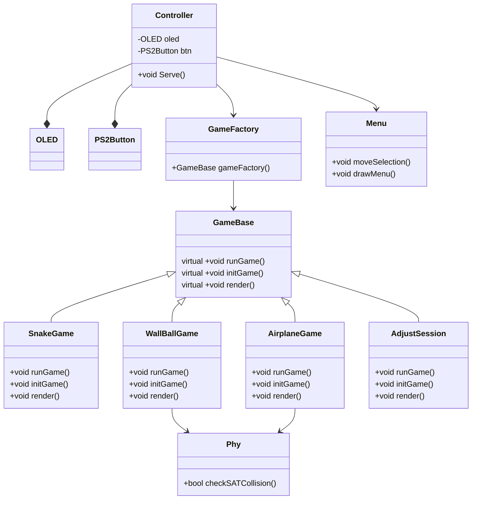
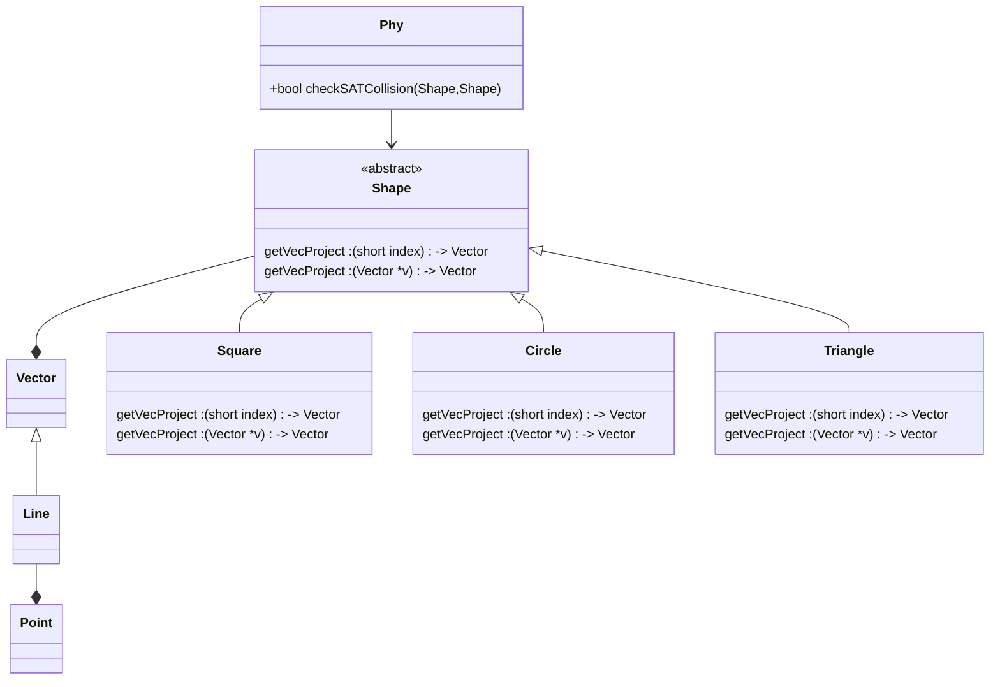

# code explanation

## structure

### source code

### physical engine

## SAT Collision Detection Algorithm

The SAT (Separating Axis Theorem) collision detection algorithm is a method used to determine if two convex polygons intersect. It works by checking the perpendicular projections of each polygon onto all possible axes and determining if they overlap.

Here's a high-level overview of the SAT collision detection algorithm:

1. **Find All Axes**: Determine all possible axes for which the polygons can be projected. These axes are typically perpendicular to the edges of the polygons.
2. **Project Polygons onto Axes**: For each axis, project both polygons onto that axis and determine if they overlap.
3. **Check Overlap**: If any pair of projections do not overlap, then the polygons do not intersect. Otherwise, they intersect.
