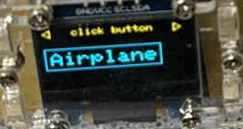

# 從頭開始做 Arduino 電子遊戲機

## 前言

前段時間和朋友約好玩交換禮物，我利用 Arduino 和 OLED 螢幕製作了一個簡單的電子遊戲機拿來交換。這篇文章將設計過程分享給大家，希望對大家有幫助！

## 目標

實作一個簡單電子遊戲機，包含以下功能：

- 菜單介面可以選擇遊戲
- 幾款小遊戲，包含貪吃蛇、打磚塊與彈幕等。




## 開發

### 硬體

第一步當然是購買元件啦。我決定好要買的東西後，就打開購物網站隨便挑了一間看得順眼的店家進行採購。目標是在同一間店把所有元件買齊，雖然事後看起來有點買貴了，但差價也不大。

選擇螢幕時，我原本想挑 LCD 顯示器，但意外看到了 OLED 螢幕，覺得聽起來更高端，於是選擇了 OLED。後來才發現雖然價格差不多，但 OLED 的螢幕大小有點小。由於交換禮物的時間臨近，就沒時間重新購買更大的螢幕。

選擇主機時，我最後選用了非原廠版本的 Arduino Uno，因為它最便宜且常見。這次我發現原廠與副廠的差異主要在於用料的紮實度，尤其體現在適配性上。副廠的 USB 控制晶片比較差，導致我剛拿到時，macbook pro 和擴充埠完全偵測不到端口，換到 windows 主機後也還是無法偵測。後來研究了一下，發現因為我的設備都比較新，都是 USB3.0 以上的速度，因此不適配副廠的 USB 控制晶片。改用 windows 主機的 USB2.0 接口後，終於正確連接上了。

最後，我的遊戲手把選用了 PS2 的蘑菇頭按鈕，包含上下左右和中心按鈕。這樣的手把可以讓玩家玩遊戲時更順暢。

其它就是隨便買一些電子零件，包含麵包版、杜邦線、電源之類的，最終的價格如下表：

|        部件        | 量  |  價格  |
| :----------------: | :-: | :----: |
|     OLED 螢幕      |  1  | 185 元 |
| Arduino Uno 開發版 |  1  | 325 元 |
|       電源線       |  1  | 80 元  |
|     PS2 蘑菇頭     |  1  | 50 元  |
|    其他電子零件    |  1  | 60 元  |

總計：185 + 325 + 80 + 50 + 60 = 700 元。

拿到這些零件後，就可以參考網路上的文件一個洞一個洞插囉。這邊我也遇到一個坑，因為這些零件來自各間副廠，他插的孔剛好跟我參考的網路文件相反，所以訊號傳遞錯誤。我後來是透過查詢商家建置的教學網站才得知這一細節。所以結論是在接線時需要仔細檢查實際硬體上的說明，並且比對最適合的網路教學再開始嘗試，務必抱持開放的態度，面對不同副廠零件之間的差異性。

以下幾個連結是我個人喜歡的參考文件，實際上該如何連還是要按照實際硬體狀況:

- [SSD1306](https://docs.wokwi.com/parts/board-ssd1306)
- [joystick](https://docs.wokwi.com/parts/wokwi-analog-joystick)

最後是接線完成後的參考圖:


### 軟體

#### 流程設計

在設計這類 OS-less 的 single core 嵌入式系統時，可以參考的其中一種設計方法是有限狀態機（Finite State Machine, FSM）。可以把整個韌體想像成一個巨大循環，循環內存在著多台可以多層嵌套的狀態機。每次循環就是在每一台狀態機中依據當時的狀態完成一次運算並轉移到下一項狀態。此外，實務上每個狀態機彼此也可以透過某種方法互相溝通，因此每次 FSM 執行所需輸入可以是自己內部的狀態加上別台狀態機提供的狀態。

以下可以用 pseudo code 表達一下這個設計方法:

```cpp
// claiming  global variable for state machine array
global stateMachine[numStateMachines]
// communication channel for each state machine
global communicationChannel

int main() {
	// init all state machines
	for (int i = 0; i < numStateMachines; i++) {
		stateMachine[i] = new StateMachine();
	}

	// infinite loop
	while(true) {
		// call action function of each state machine based on communication channel
		for (int i = 0; i < numStateMachines; i++) {
			stateMachine[i]->Serve(communicationChannel);
		}
	}
}
```

接著，按照真實案例，我想像中的遊戲機使用流程如下:

1. 使用者開機，看到開機畫面
2. 開機後有選單可以選擇不同款遊戲，點擊確認後進入遊戲模式
3. 在遊戲模式中玩遊戲，遊戲結束後顯示得分
4. 玩家確認得分後回到遊戲選單，可以重新選擇遊戲

至此可以畫出整體流程所需的狀態機如下:


其中 Welcome、Menu、Game 和 Result 是狀態機的狀態。各自的定義如下:

- Welcome: 開機初始畫面。
- Menu: 游戲選單，顯示不同款遊戲供用戶選擇。
- Game: 遊戲畫面，玩家可以進行操作，例如按鍵控制角色移動等。
- Result: 遊戲結束，顯示得分。

#### 流程實作

關於 arduino 的開發環境等設置，請自行參考其他文件，也可以參考本專案的 [README.md](../README.md)。

假設已經完成環境配置，打開 Arduino IDE 的 sample code 後應該可以看到以下模板:

```cpp
void setup() {
  // put your setup code here, to run once when the board is powered up
}
void loop() {
  // put your main code here, to run repeatedly
}
```

這兩行就是 Arduino 的生命週期函數，`setup()` 函數在板子啟動時執行一次，而 `loop()` 函數則會不斷重複執行。

因此按照上一節的設計理念，我們可以設計一個 FSM，在 `setup()` 函數中初始化，並在 `loop()` 函數中重複調用該 FSM 的行為函數。這樣就可以完整的實作出目標系統了。

以下就是最終我的 Arduino 專案主程式入口:

```cpp
Controller *controller = nullptr;

void setup()
{
	controller = new Controller();
}

void loop()
{
	controller->Serve();
}
```

下一步就是按照設計中的狀態表實作狀態機 "controller" 的行為函數與內部狀態。

```cpp
enum ControllerState
{
	Welcome,
	Menu,
	Game,
	Result
};

class Controller
{
private:
	ControllerState state;

public:
	Controller(/* args */);
	~Controller();

	void Serve(void);
};

void Controller::Serve(void)
{
	ControllerState curState = this->state;
	switch (curState)
	{
	case Welcome:
		this->state = Menu;
		break;
	case Menu:
		this->state = Game;
		break;
	case Game:
		this->state = Result;
		break;
	case Result:
		this->state = Menu;
		break;
	}
}
```

至此，一個可以空轉的流程實作完畢，可以利用 Serial Monitor 或其他工具來觀察狀態機的動作。

#### 分層架構

有了基本的狀態機後，下一步是讓狀態機可以在行為函數中調用外部 IO 完成輸入輸出，如此一來搖桿可以開始操作狀態機，狀態機也可以透過 OLED 屏幕展示畫面。

想要在系統設計中完成這一步，常見的作法是使用分層架構（Layered Architecture），其思想可以被簡化為以下幾點：

- 權責分配：將系統功能分成不同的層級，每個層級都有自己的任務和責任。
- 解耦：避免不同層級之間的直接依賴，而是通過接口或函數來實現通信。
- 可擴展性：當需要增加新的功能時，只需要修改特定的層級即可，而不需要影響其他層級。

在這個例子中，我們可以將系統功能分成以下幾層：

1. **Controller Layer**：負責控制系統的生命週期，包括初始化、運行和停止等操作。
2. **Service Layer**：負責處理系統的核心業務邏輯，例如遊戲本體的運行、玩家輸入的處理、遊戲畫面的渲染等。
3. **Hardware Layer**：負責與 I/O 硬體通訊，聚焦在純粹硬體操作 API 的串接。

因此，在我的設計中，我會在 Hardware Layer 中實現以下兩個模組:

- Arduino 讀取搖桿動作的功能。
- Arduino 操作 OLED 視窗的渲染功能。

這樣一來，遊戲本體和系統流程就可以和外部 IO 裝置解耦，可以更順利的完成開發和測試。

#### 硬體層實作

在這個層次，主要價值是串接硬體與核心業務邏輯。因此應該盡可能的簡單而明確，不需要額外添加太多功能或複雜性。

在 `sketch\ps2btn.cpp` 中，透過 Arduino 開發版直接讀取 pin 上關於搖桿硬體的類比與數位信號，並回傳表示在那個時刻搖桿所檢測到的資訊。

接著在 `sketch\ps2btn.cpp` 中更有趣的部份是利用 interrupt 機制完成按鈕觸發與搖桿的校正方案等兩點。

使用 `analogRead` 可以讀取對應 pin 的類比訊號，按照教學書中的說明，這是一個 `0` 到 `1023` 的數值，可以表示搖桿在該方向上的位置。

- `VERT_PIN` 表示搖桿的垂直方向。
- `HORZ_PIN` 表示搖桿的水平方向。

```cpp
void PS2Button::updateRawBtnDir(void)
{
	int vert = analogRead(VERT_PIN);
	int horz = analogRead(HORZ_PIN);
	this->controlRawX = vert;
	this->controlRawY = horz;
}
```

我定義了 `enum` 來表示搖桿的指向，當別層調用函數 `getDir` 時可以收到不同的方向。

```cpp
enum BUTTON_DIRECTORY
{
	UP,
	DOWN,
	LEFT,
	RIGHT,
	MID,
};

BUTTON_DIRECTORY PS2Button::getDir(void)
{
	this->updateRawBtnDir();

	int newX = this->controlRawX - naturalMiddle_x;
	int newY = this->controlRawY - naturalMiddle_y;

	if (ABS(newX) < XY_MIDDLE_RANGE && ABS(newY) < XY_MIDDLE_RANGE)
	{
		return MID;
	}

	if (ABS(newX) > ABS(newY))
	{
		if (newX > 0)
		{
			return RIGHT;
		}
		else
		{
			return LEFT;
		}
	}
	else
	{
		if (newY > 0)
		{
			return DOWN;
		}
		else
		{
			return UP;
		}
	}
}
```

上面的 `naturalMiddle_x` 與 `naturalMiddle_y` 存放了搖桿的自然偏移量，可以在下面的 `adjust` 函數被更新，該函數應該盡可能在確定使用者沒有移動搖桿的情境下使用。原理是把未移動的搖桿回傳座標視為中心點。舉例來說，理想的搖桿中心座標應該是 `(512,512)` ，但今天實際的搖桿中心座標卻是 `(400,412)` 因此如果沒有校正座標，最後感測的方向會產生錯誤，所以要改成把 `(400,412)` 設定為中心點，這樣就可以避免這種問題了。

```cpp
void PS2Button::adjust(void)
{
	delay(1000);
	updateRawBtnDir();
	naturalMiddle_x = this->controlRawX;
	naturalMiddle_y = this->controlRawY;
}
```

最後，因為硬體控制搖桿具有按鈕，但是使用者對按鈕的想像是按下後就會觸發，不用一直壓著，因此不可能是在 `isClickBtn` 函數觸發的當下直接讀取數位信號。
